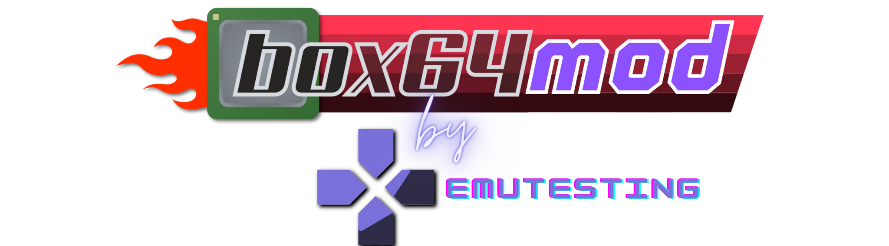

English
&nbsp;&nbsp;| &nbsp;&nbsp;
<a href="https://github.com/GabiAle97/Box64Droid/blob/main/README-es.md">Español</a>

# Box64Droid
Box64Mod is a modification of [Box64Droid](https://ilya114.github.io/Box64Droid/) project with scripts that adds some missing libraries and add some customization configurations, as well as some newer Turnip and Wine installers. Can't launch all games in the world in 4K 60 FPS, note it when you trying launch AAA games, but it does launch some major ones like RE2/RE3 Remake.

## Installation instructons
Install [Termux](https://github.com/termux/termux-app/releases/download/v0.118.0/termux-app_v0.118.0+github-debug_arm64-v8a.apk) and [Termux-x11](https://github.com/Ilya114/Box64Droid/releases/download/stable/app-arm64-v8a-debug.apk), then in Termux run Box64Droid install command: 
```
curl -o install https://raw.githubusercontent.com/GabiAle97/Box64Droid/main/scripts/install && chmod +x install && ./install
```

After the installation is completed, type `box64droid --start`, starting script will start Termux-X11 and show start menu.

You also can use Input Bridge, install 0.1.9 apk then just run app in Android and in Wine from start menu

## System requirements 

- Adreno 610+ (Another supporting by VirGL but much games don't working)
- Android 12+ (non-root, VirGL version), Android 10+ (root version)
- 64-bit Android 
- You also need at ~4,2 (for root version), 4,5 (for non-root version) and ~3,3 GB (for VirGL version) free space for the installation without problems.
- If you want get more FPS and stability, use root version (you need root rights on your device)

## Configuring

You can choose to use environment variables, there are 3 files, `DXVK_D8VK.conf`, `Box64Droid.conf` and `DXVK_D8VK.conf`. These files are created and found in the /sdcard/Box64Droid/ folder after the first Box64Droid run.

The `Box64Droid.conf` file is with rootfs, Box86, Box64 and Wine configuration. You can use the Box86 and Box64 environment variables, see all of them [here](https://github.com/ptitSeb/box86/blob/master/docs/USAGE.md#) and [here](https://github.com/ptitSeb/box64/blob/main/docs/USAGE.md). You can add as many variables as you like.

The `DXVK_D8VK_HUD.conf` file is for you to use the environment variables referring to [DXVK_HUD](https://github.com/doitsujin/dxvk#hud).

The `DXVK_D8VK.conf` file is for you to use the environment variables referring to [dxvk](https://github.com/doitsujin/dxvk/blob/master/dxvk.conf).

## Known issues

- Error when updating Termux packages. Clear Termux data will help.
- Android 12+ can kill Termux, you may get `[Process completed (signal 9) - press Enter]`, to fix run this command in adb shell:
```
adb shell "/system/bin/device_config put activity_manager max_phantom_processes 2147483647"
```
- "Control" menu in Wine (in Wine Proton 8.0-2 working fine) shows nothing. You can just open `control` using "Run"
- Winetricks runs a long of time when Proton installed (non-root version)

If you have another problems you can ask me in:

- [Discord](https://discord.gg/a2Xmz8VP)

News about project publising in [YouTube](https://www.youtube.com/channel/UC3hKKXC1EbYnAj6ooWxfrjA) channel.

## Instructions how to mount SD-card external HDD/SSD (chroot version)

If you want mount sdcard or external HDD (SSD), you need to add mountpoint maually. For SD-card go to /storage and see (`sudo ls`) folder example `8D3E-2B7K`. For external drives go to /mnt/media_rw and see folder like `C3G3H6B8A56212H7`. Type `nano $PREFIX/bin/box64droid` and add mount command before `sudo chroot login ...` line: `sudo mount --bind /mnt/media_rw/drivename (or /storage/sdcardname) $ROOTFSPATH/needfolder`. You need to create `needfolder` yourself in ~/ubuntu folder by using `sudo mkdir foldername` 

## Things to note

Some issues/instabilities can happen when using Box86 and Box64 in proot environment, so it's not recommended to use Box86 and Box64 in proot as debug/testing environment, there are better options for that.

## Applications and scripts which using in Box64Droid
- [Termux-app](https://github.com/termux/termux-app) - GPLv3 license
- [Box64 by ptitseb](https://github.com/ptitSeb/box64) - MIT license
- [Box86 by ptitseb](https://github.com/ptitSeb/box86) - MIT license
- [Wine Stable, Staging and Staging-tkg GPL-2.1 license](https://wiki.winehq.org/Licensing) (builded by [Kron4ek](https://github.com/Kron4ek) by MIT License), [Wine Proton by Valve](https://github.com/ValveSoftware/Proton) (own license), [Wine GE](https://github.com/GloriousEggroll/wine-ge-custom) (using in Lutris)
- [Mesa](https://docs.mesa3d.org/license.html) - MIT, Khronos, SGI Free Software License B and Boost (permissive) licenses
- [Termux-x11](https://github.com/termux/termux-x11) - GPL-3.0 license
- [DXVK](https://github.com/doitsujin/dxvk) - Zlib license
- [Proot-distro](https://github.com/termux/proot-distro) - GPL-3.0 license
- [Forked Mesa to work Turnip on Adreno 730 and 740](https://gitlab.freedesktop.org/Danil/mesa/-/tree/turnip/feature/a7xx-basic-support)
- [D8VK](https://github.com/AlpyneDreams/d8vk) - Zlib license
- [DXVK-Async](https://github.com/Sporif/dxvk-async) 
- [DXVK-GPLAsync](https://gitlab.com/Ph42oN/dxvk-gplasync)
- [WineD3D for Windows](https://fdossena.com/?p=wined3d/index.frag) - GPL-2.0+ license
- [Winetricks](https://wiki.winehq.org/Winetricks)
- [vkd3d-proton](https://github.com/HansKristian-Work/vkd3d-proton) - LGPL v2.1 license
- [Box64Droid](https://github.com/Ilya114/Box64Droid) - GPL-3.0 license
- [Termux-Box](https://github.com/olegos2/termux-box) - GPL-3.0 license

## Thanks to:
- [Herick75](https://github.com/Herick75) - for Mesa Turnip patches which make possible compile it
- [Inguna87](https://github.com/inguna87) - for start chroot fix for MIUI and Oxygen
- [Alfhashut](https://github.com/alfhashut) - inspired me to try VirGL again and trying help me with him
- [Mr.Purple](https://github.com/MrPurple666) - Helped with the system updating and Turnip compiling
